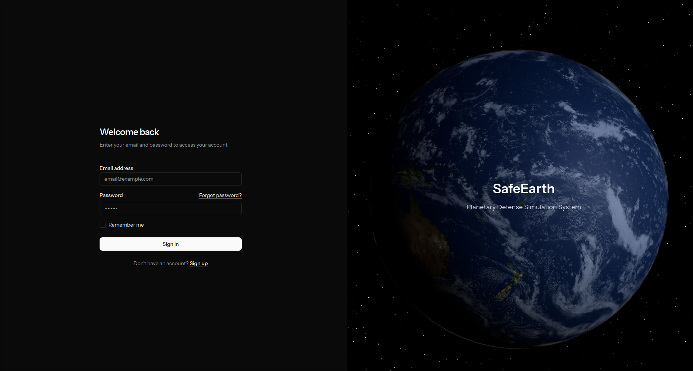
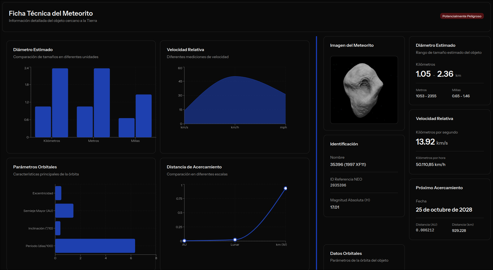
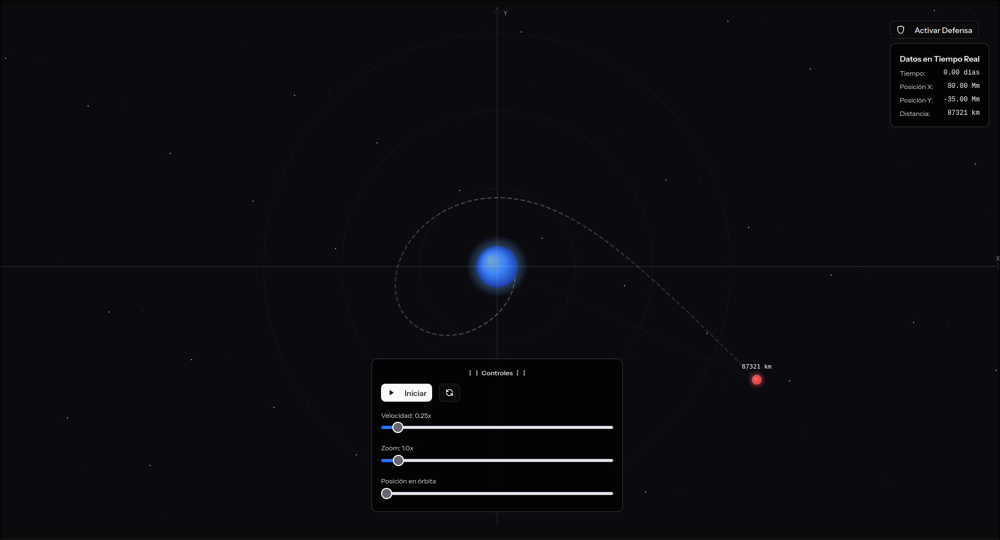
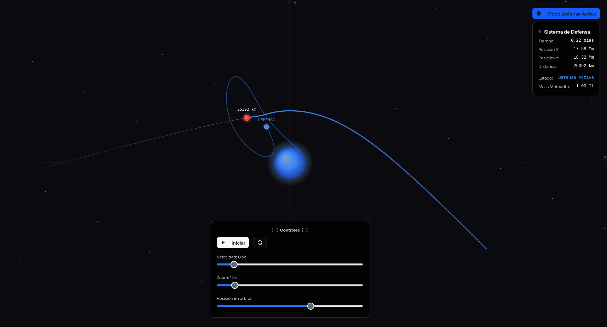
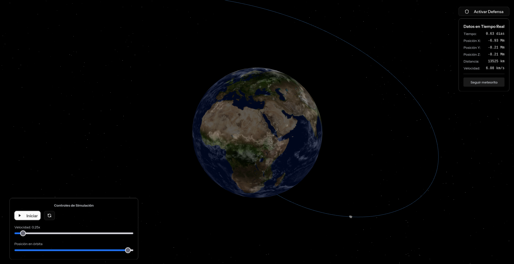
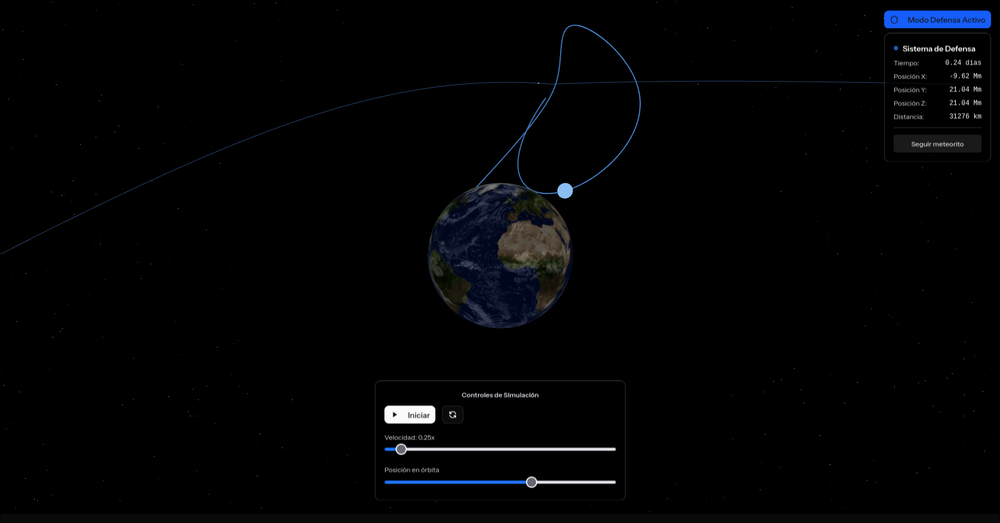
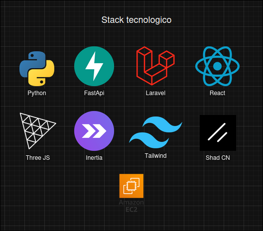
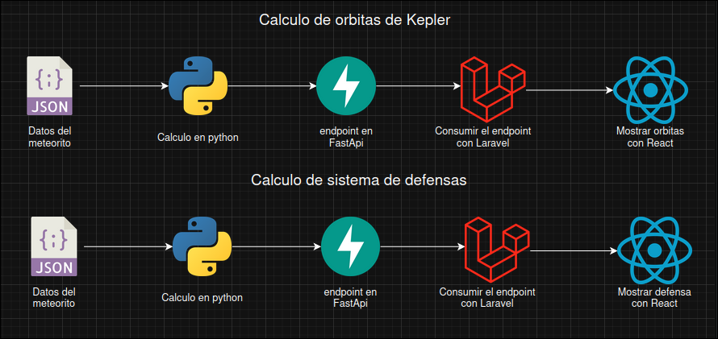

# SafeEarth - Planetary Defense Simulation System

A sophisticated web-based simulation system for modeling asteroid trajectories and planetary defense mechanisms using Kepler's orbital mechanics.


## Overview

SafeEarth is an interactive platform that simulates asteroid trajectories and defense systems in both 2D and 3D environments. The system uses real Keplerian orbital mechanics to accurately model celestial body movements and defense interception scenarios.

## Screenshots

### Login & Authentication

*Modern authentication interface with 3D Earth visualization*

### Dashboard

*Main control panel*

### 2D Simulation

*Real-time 2D trajectory visualization*


*Defense system simulation in 2D*

### 3D Simulation

*Interactive 3D space environment*


*Defense interception in 3D space*

### Key Features

- **2D/3D Trajectory Simulations** - Visualize asteroid paths using real orbital mechanics
- **Defense System Modeling** - Simulate rocket launches and satellite interception
- **Real-time Analytics** - Track position, velocity, and collision probabilities
- **Secure Authentication** - User management with 2FA support
- **Interactive 3D Visualization** - Three.js powered Earth and space environment

## Mathematical Foundation

### Kepler's Orbital Mechanics

The system calculates asteroid trajectories using Keplerian orbital mechanics. The position r(t) at any time is computed through the following process:

#### 1. Finding the Eccentric Anomaly

Using a convergent Fourier-Bessel series expansion:

```
E(t) = M(t) + 2∑(s=1 to ∞) s⁻¹Jₛ(se)sin(sM(t))
```

Where:
- `E(t)` is the eccentric anomaly
- `M(t)` is the mean anomaly
- `Jₛ` are Bessel functions
- `e` is the orbital eccentricity

#### 2. Calculating Radial Distance

From the Kepler equation:

```
r(t) = a(1 - e·cos(E(t)))
```

Where:
- `a` is the semi-major axis
- `e` is the eccentricity

#### 3. True Anomaly

The relationship between true anomaly and eccentric anomaly:

```
ν = 2·arctan(√((1+e)/(1-e))·tan(E/2))
```

#### 4. Orbital Coordinates

Finally, position in orbital plane:

```
x_orb = r·cos(ν)
y_orb = r·sin(ν)
```

These coordinates are then transformed to inertial reference frame for 3D visualization.

## Tech Stack

### Frontend
- **React 18** - UI framework
- **TypeScript** - Type safety
- **Inertia.js** - SPA without API
- **Three.js** - 3D graphics
- **@react-three/fiber** - React renderer for Three.js
- **@react-three/drei** - Useful helpers for Three.js
- **@react-three/rapier** - Physics engine
- **Tailwind CSS** - Styling
- **shadcn/ui** - UI components

### Backend
- **Laravel 11** - PHP framework
- **Laravel Fortify** - Authentication
- **Inertia.js** - Server-side adapter
- **MySQL/PostgreSQL** - Database

### External APIs
- **NASA NEO API** - Real asteroid data
- **Python Kepler Server** - Orbital calculations and defense simulations
  - Repository: [Python Kepler Backend](LINK_TO_PYTHON_REPO)
  - Deployed on AWS EC2: `http://3.141.38.117`



### processes


## Python Backend Repository

The Kepler orbital calculations and defense simulations are powered by a separate **FastAPI** microservice. This Python backend handles:

- **Kepler's Equation Resolution** - Using Fourier-Bessel series for eccentric anomaly computation
- **Orbital Trajectory Calculation** - 2D and 3D position/velocity data
- **Defense Simulation** - Rocket and satellite trajectory calculations

**Repository**: [Python Kepler Backend](https://github.com/Roberto0611/orbital-simulator)

**Current Deployment**: `http://3.141.38.117`

### Available Endpoints
- `/datos2D` - 2D meteor trajectory data
- `/datos3D` - 3D meteor trajectory data  
- `/defensaDatos2D` - 2D defense simulation data
- `/DefensaDatos3D` - 3D defense simulation data
---

## Live Deployment

The entire **SafeEarth** application is deployed on **AWS EC2** infrastructure, providing a production-ready environment with:

- **Laravel Backend** - PHP application server
- **React Frontend** - Built assets served with Vite
- **Python Microservice** - FastAPI calculations server
- **Load Balancing & Security** - AWS networking and security groups

**Live Application**: [SafeEarth on AWS](http://3.141.38.117:8080/)

---

## Installation

### Prerequisites

- PHP 8.2+
- Composer
- Node.js 18+
- npm or pnpm
- MySQL/PostgreSQL

### Setup

1. **Clone the repository**
```bash
git clone https://github.com/AldoKar/safeEarth.git
cd safeEarth
```

2. **Install dependencies**
```bash
composer install
npm install
```

3. **Environment setup**
```bash
cp .env.example .env
php artisan key:generate
```

4. **Configure database**
Edit `.env` file with your database credentials:
```env
DB_CONNECTION=mysql
DB_HOST=127.0.0.1
DB_PORT=3306
DB_DATABASE=safeearth
DB_USERNAME=your_username
DB_PASSWORD=your_password
```

5. **Run migrations**
```bash
php artisan migrate
```

6. **Build assets**
```bash
npm run build
```

7. **Start development servers**
```bash
# Terminal 1 - Laravel
php artisan serve

# Terminal 2 - Vite
npm run dev
```

Visit `http://localhost:8000` 

## Usage

### Simulations

**2D Mode:**
- Navigate to "Simulación 2D"
- Toggle between Normal and Defense modes
- Control playback speed and timeline
- View real-time trajectory data

**3D Mode:**
- Navigate to "Simulación 3D"
- Explore 3D space with orbit controls
- Watch defense systems in action
- Interactive camera controls

### Defense System

1. Activate **Defense Mode** toggle
2. Watch as the system:
   - Launches rocket from Earth (blue trajectory)
   - Deploys interceptor satellites (green trajectories)
   - Satellites intercept and detonate near asteroid
3. View success/failure analysis

## Authors

- Roberto Ochoa Cuevas
- Aldo Karim Garcia Zapata
- Andres Rodrigues Cantu

## Acknowledgments

- NASA for NEO API
- Three.js community
- Laravel & React communities
- Kepler orbital mechanics research
- SAERO
- Tecnologico de Monterrey

---

**Built for SAERO apocalypsis hackathon**